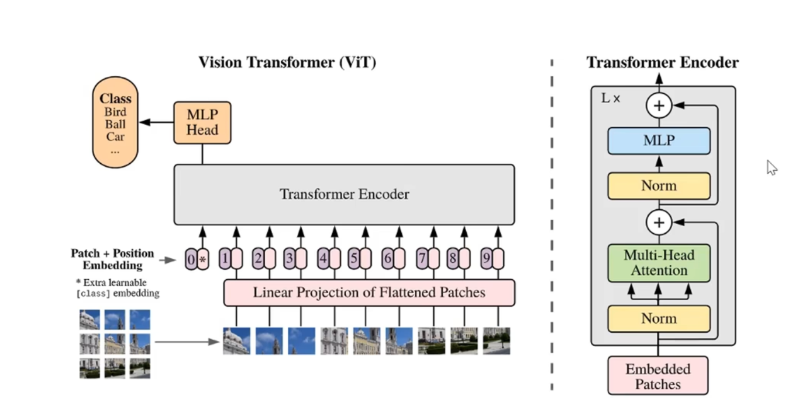

# ViT理论

ViT架构图
 

- 每个`patch`对应一个token
- 加上一个带有分类信息的`[CLS] Token`,与token的维度是一样的

> 维度的变化

- 对于标准的Transformer模块，要求输入的是token(向量)序列,即二维矩阵`[num_token, token_dim]`
- 在代码实现中,直接通过一个卷积层来实现.
  - 以ViT-B/16为例,使用卷积核大小为`16x16`,`stride=16`,卷积核大小为`768`
  - 维度变化: `[224, 224, 3]` → `[14, 14, 768]` (0,1维度flatten)→ `[196,768]`
  - 在输入Transformer Encoder之前需要加上`[class] token`以及`Position Embedding`,都是可训练的参数
    - 拼接`[class] token`: `concat([1, 768], [196, 768])` → `[197, 768]`
    - 叠加`Position Embedding`: `[197, 768]` → `[197, 768]`
